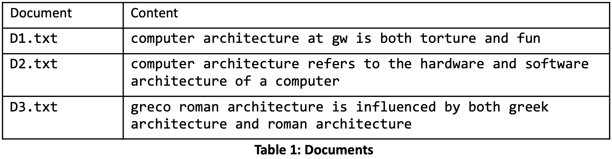
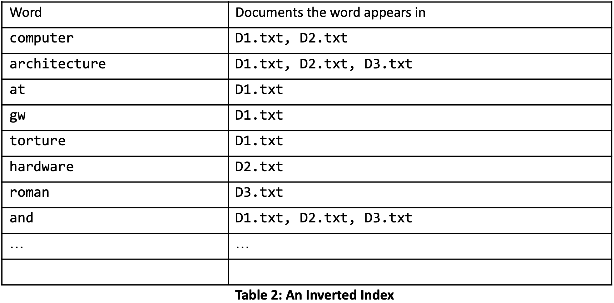
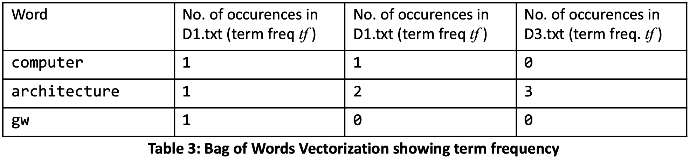
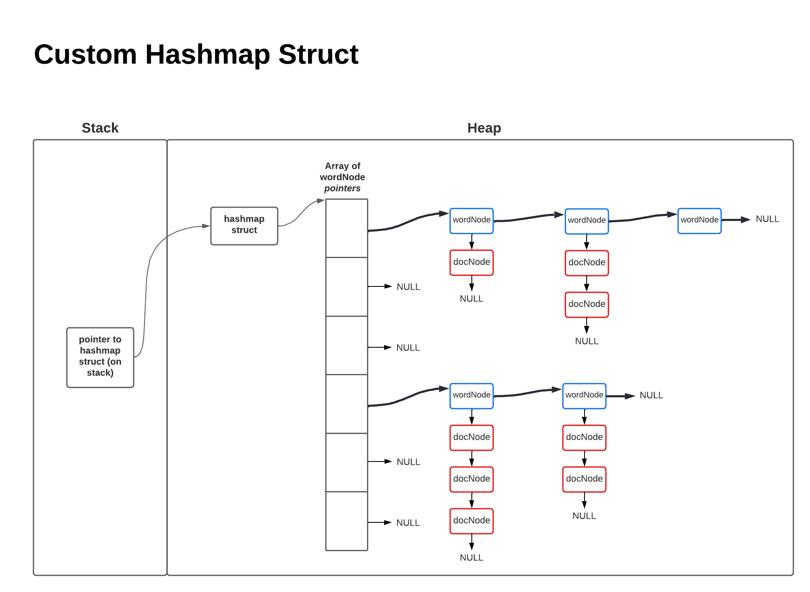
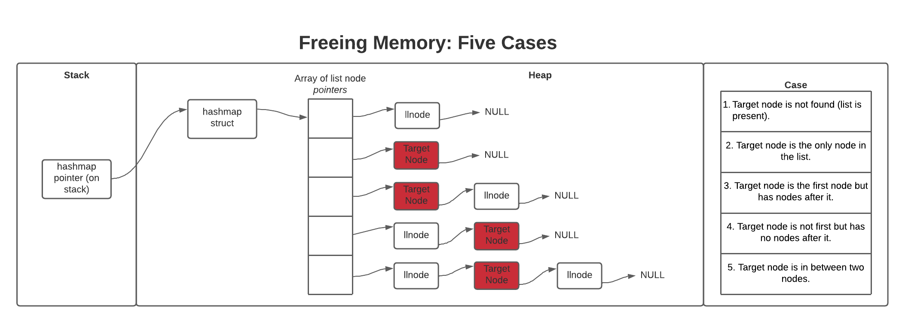

# CoogleEngine
Meet Coogle: my C implementation of a search engine backend.

### To do

* read design doc and write an explanation of what this thing is supposed to do and how it's supposed to do it
* once you understand the hashmap data structure thoroughly then go comment all the code and make edits

* comment
* develop and run test suite
* write readme
* make a logging function that saves all inputs and output to file for debugging info (typescript)

## Big Picture 
we need to find the .txt files that contain at least some of the words in the query and then rank the files in order of relevance. The most relevant files would be ranked first, and the least relevant file would be ranked last.

### Training Phase
1. read in a directory containing text files from the user
2. create a hashmap struct which will store all text data in a more searchable form 
3. for each document in the directory add each word to the hashmap 
    each word has a linked list coming off it which has a node for 
    each document the word is in and the frequency of the word in that document 
4. remove words that appear in all document? or maybe just remove stop words?
    free memory of words you remove

Goal of training phase: create an inverted index (important concept in search algorithms)


Stop word protocol: remove all words present in all 3 documents 

### Search Phase 
1. read in a search query from user
2. for each word in the search query
    find the word in the hashmap (if its present)
    find the document rank for that word
3. compile the docuemnt ranks for all words into an average document rank and return that


### Destroy Phase
1. free all heap memory that was allocated at any point


### Data structures
* two linked list structs (called docNode and wordNode)
* a hashmap struct (called hashmap)

## assumptions
* documents of interest are all in the same directory

### Function Headers

#### int main()
* calls createHashmap(), trainHashmap(), and readQuery

#### struct hashmap* createHashmap(char* directory, glob_t* globPtr, int numBuckets);
* assigns hashmap file pointer to results of glob
* 

#### struct hashmap* trainHashmap(struct hashmap* hashmapPtr, char* directory, glob_t* globPtr, int numBuckets );
* calls 

#### void hash_table_insert(struct hashmap* hashmapPtr, char* word, int docID);
*

#### struct wordNode* findWord(struct hashmap* hm, char* word, int insertMode);
*

#### void addDoc(struct wordNode* wordPtr, int docID);
*

#### void stop_word(struct hashmap* hm, int numDocs);
*

#### int hm_get(struct hashmap* hm, char* word, char* document_id);
*

#### void hm_put(struct hashmap* hm, char* word, char* document_id, int num_occurrences);
*

#### void removeWord(struct hashmap* hm, struct wordNode* trailingPtr, struct wordNode* Ptr);
*

#### void freeWord(struct wordNode* wordPtr);
* clears memory from ...
* called in hmDestroy

#### void hmDestroy(struct hashmap* hm);
*

#### int hash(int numBuckets, char* word);
*
#### void rank(struct hashmap* hm, int numFiles, int querySize, char** query);

#### int readQuery(struct hashmap* mapStructPtr, int numFiles);

#### double tfidfCalc(struct wordNode* wordPtr, int docID, int numFiles);


////////////////////////////////////////////////////////////////////////////////////////////////////////

## The term frequency-inverse document frequency (tf-idf) page rank algorithm

The term frequency-inverse document frequency (tf-idf) method is one of the most common weighting algorithms used in many information retrieval systems as well as in many Natural language processing (NLP) systems. 

A search query submitted by a user of the search engine typically consists of a number of words/terms. Therefore, we have to determine the relevance, or rank, of the document for the entire search phrase consisting of some m number of words w1, w2....wm , using the tf-idf scores for each word. The relevance, or rank, Ri of document i for this search phrase consisting of m words, is defined as the sum of the tf-idf scores for each of the m words.

The tf-idf score gives us a measure of how important a word is to a document among a set of documents. It uses local term frequency (occurences of a word within a single document) and global inverse document frequency (inverse of occurences of the word across documents) to scale down the score of common terms and scale up the score of rare terms.

The tf-idf(w,i) weight of a term (word) w in document i is the product of its term frequency tf(w,i) and inverse document frequency idf(w).

tf-idf(w,i) = tf(w,i) × idf(w)

The tf-idf(i) rank of a document i is the sum of the tf-idf scores for each of the m words in the search query.

tf-idf(i) = tf-idf(w1,i) + tf-idf(w2,i) + tf-idf(w3,i) + ... + tf-idf(wm,i)

#### Term Frequency (tf): 
The term frequency tf(w,i) of a term (word) w in document i is the raw frequency of the word in the document. There are variations of term frequency that are used in different search algorithms; for example, since raw frequency may not always relate to relevance they divide the frequency by the number of words in the document to get a normalized raw frequency.

#### Inverse Document Frequency (idf): 
Many times a rare term/word is more informative than frequent terms. Stop words (such as “the” “for” etc.) appear often and usually are not very informative as to the relevance of a document. The inverse document frequency idf(w) considers how frequent the word occurs across the documents being searched. It is the natural log of the number of documents in the direcory being searched (N) divided by the document frequency df(w) which is the number of documents that contain the word w.

idf(w) = log (N / df(w))

If no documents contain the word then df(w)=0 so 1 must be added to the denominator of the above equation to handle the divide by zero case. For this case idf(w) = log (N/(1). The natural logarithm is used, instead of just N/df(w) to dampen the effect of idf (The natural log could be replaced by any base). If the natural log was not taken the idf would have a much greater effect than the tf on the tf-idf ranking.

The tf-idf ranking scores are printed to a file in the same directory as the program. The file is named `searchScores.txt` and it will contain the filename:score for your query on each document in descending order (delimited by new lines).


## Example 
Lets say the directory to be searched contains the following documents and the search query is “computer architecture GW”.


The hashmap data structure is created to store an inverted index of the document contents. Though not shown in the table, the frequency of a given word in a given document is stored alongside the document itself.



The search query is then represented by the occurrence counts of each word in the query. This is called the bag of words (BOW) model. The order is lost – for example, “john is quicker than mary” and “mary is quicker than john” both have the same representation in the BOW model. Thus a query of size m can be viewed as a set of m search terms/words w1, w2,...wm and the bag of words model vectorizes this query string by counting how many times each word appears in the document.




## Data structures/implementation 
Hashmaps are an efficiently searchable organization of data. The hash map implemented here contains a linked list of words with a linked list of documents containing that word coming off of each word node. The hashing function sums the ascii values of each character in a word and uses this value (mod num buckets) to place words in their respective buckets.



When a query is searched the rank function loops through each document and then loops through each word in the search query to calculate and sum the tf-idf score for each word for each document. The documents are then sorted by score to arrive at the final ranking.

```
Rank function{

    For each document i in directory:
        For each word w in search query:
            •get linked list pointer to word node using findWord()
            •calculate tf-idf for document i word w using tfidfCalc()
            •add this tf-idf score to the sum of tf-idf scores for document i
        }
    }

    Sort array of document scores in descending order to produce final ranking

}
```


```
// defines hashmap struct
struct hashmap {
        struct wordNode** pointerArray;
        int num_buckets;
        int numFiles;
        char** fileNames;
};

// defines word linked list struct
struct wordNode {
        char* word;
        int docFrequency;
        struct wordNode* nextWord;
        struct docNode* docList;
};

// defines document linked list struct
struct docNode {
        int docID;
        int termFrequency;
        double* tfidf;
        struct docNode* nextDoc; 
};
```


## Freeing Memory  
To prevent memory leaks an exhaustive freeing of all allocated memory must be performed before the program terminates. This diagram shows the cases considered when developing code to deallocate all heap memory. Note the cases for the docNode linked list are the same as for the wordNode linked list (or for any linked list).




----------------------------------------------


Hashmap vs Hashtable
https://www.geeksforgeeks.org/differences-between-hashmap-and-hashtable-in-java/

How I'll handle collisions: chaining

Key = word+documentID asccii sum
Value = number of occurences of the word in that document

This hashmap will free memory automatically when nodes are removed to prevent memory leaks and maintain performance over time.


* in put method: efficiency gain by adding new node to front instead of back? 

* transfer testing print statement from hashmap.c into assert statements in test.c

* man pages
* GDB
* valgrind
* make file
* assert statements to test
* comment in info on each line of makefile 
* for each function for each parameter null check it 
* use Strcmp = string compare 
* write in some assembly directly into C to make it faster 

* make a demo folder so people can clone the repo and search amongst given files (maybe integrate a java or python GUI)

Questions
* how would I go about integrating a Java or Python GUI with this C code?
* what is the point of the #define HASHMAP_H command at the top of the header file? It's a compiler thing - find out more 

Why would the number of occurences passed into hm_put ever be more than one?
the number of occurences passed into put is determined by calling get and incrementing the number of occurences returned

Is chaining the linked list in a buckett design choice or is it overwriting num occurences 

Each value is assigned a key
The key is input into a hashing function which places the key in a bucket out of N buckets
The key value pair is then added to the end of the linked list at that bucket

A collision, or more specifically, a hash code collision in a HashMap, is a situation where two or more key objects produce the same final hash value and hence point to the same bucket location or array index.

## Bug note 
After completing each method and writing a simple test case I ran Valgrind to check for memory leaks. While I did not have any leaks I did have 3 invalid read errors which led to a segmentation fault. I realized quickly that 1.) I did not set the pointer to the word and document id passed in as a parameter to NULL in the remove method. This means the pointers to the word and  , the pointer to the word

In C, pointers are passed by value meaning a copy of the value is made and that copy is passed into the function. Therefore, setting the paremter pointer equal to NULL is setting a copy of the original pointer equal to NULL but the original pointer used in the calling function remains. Therefore, one needs to dereference the pointer and set that value to null instead of just assigning the copy pointer to NULL.

If you make a copy of a pointer that is pointing to null and you change the copy the original pointer will stilll point to null because null is an address and when you set the copy to a value it changes the address that that copy pointer points to. If you make a copy of a pointer that points to a valid struct and change the contents of the struct from the copy pointer the contents of the struct of the original pointer will also change. This difference depending on wether the pointer is null or valid really messed up my saturday morning. 

## Testing the hashmap

* does each method handle NULL and invalid parameters properly?
* does each method perform as intended? 
* are there any memory leaks?
* does the test suite work on the SEAS shell?

### struct hashmap* hm_create(int num_buckets);
* input of negative or zero buckets must return NULL pointer

### int hash(struct hashmap* hm, char* word, char* document_id);  
* input of null pointer must print warning message and return -1

### int hm_get(struct hashmap* hm, char* word, char* document_id);
* input of NULL pointer must return -1

Five get cases 
1. list not initialized 
2. list initialized but item not present (return -1)
3. list initialized and item at front of list 
4. list initialized and item in between two nodes
5. list initialized and item at rear of list

### void hm_put(struct hashmap* hm, char* word, char* document_id, int num_occurrences);
* input of NULL pointer must return with a warning message
* input of negative num_occurences must return with a warning message 

Three put cases:
1. list not initialized 
2. adding item to rear of existing list
3. overwriting num occurences in an existing node

### void hm_remove(struct hashmap* hm, char* word, char* document_id);
* input of null pointer must return with a warning message 

Six remove cases:
1. List uninitialized
2. Target node is not found (list is present).
3. Target node is the only node in the list.
4. Target node is the first node but has nodes after it.
5. Target node is not first but has no nodes after it.
6. Target node is in between two nodes.

### void hm_destroy(struct hashmap* hm);
* input of null pointer should print warning message and return
* input of valid pointer should free all associated memory 

1. linked lists uninitialized
2. one or more linked lists initialized 

///////////////////////////////////////////////////////////////////////

A formal description of the search problem:

### Input: 
* search query string consisting of a number of words entered into command line (standard in) 
* Set of documents labelled D1.txt, D2.txt,...D_i.txt etc. in a subdirectory titled p5docs

### Task: 
1. Training phase
    A. Create a hashmap where:
        * Each bucket contains a linked list
        * Each linked list node is a struct containing a single word and the DF of that word
        * each word struct contains a pointer to a linked 
        * each node in this linked list is a struct containing a single document ID and the num occurences of the word in that document
    B. Remove stop words from hashmap 

2. Search phase 
    A. read search query words from standard in
    b. save in an array of string arrays somehow 
    c. for each document 
        score =0;
            for each word in each document{ 
                findWord
                get tfidf
                score = score + tfidf
            }
            save document score into 2D array 
            sort array using quicksort
            print rankings to file and to console

    
    compute tF-IDF?

    B. create a file called search_scores.txt
    C. Save search query and list of documents by their DF-IDF into search_scores.txt in format filename:score for your query on each document in descending order (delimited by new lines)
    C. Display contents of the most relevant document to the terminal 


### Assumptions and additional specifications
* *each document contains several words (how would you make sure empty docs don't crash your program?)
* no word is longer than 20 characters (it is possible to design a solution without this assumptions).
* the document only contains words from the English alphabet (no digits or special characters from the keyboard)
* all words are in lower case (see if you can write a program that is case insensitive) – if you implement this option, then please indicate this clearly in your documentation (code comments).
* the search query phrase can be of an arbitrary length as long as each word is no longer than 20 characters
* the search query phrase is entered by the user at run-time after the training phase (when all the documents have been read)
* The program must prompt the user for the query keywords and then return the result of the search
* After returning the results the program will return to prompt for the next query set or for special symbol # to exit the program. 
* The number of buckets in the hash table is specified at run-time by the user.
* You should also implement the option for the number of buckets to be computed statically during the training phase
* You should not make any assumptions on the contents of the documents or the query words
* create a documentation where you specify the assumptions you made and what hash function you used etc

#### Necessary functions
    int hash(char* word){
        // hashes word to a bucket
    }

    void hash_table_insert(char* word, char* docID){
        // hashes word and creates new node for the word or updates existing document frequency for that word and document combo
    }

    void training(set of documents){
        returns the populated hash table as output
    }

    void read_query() {
        read the search query from the command line
    }

    void rank() {
        // computes the score for each document based on DF-IDF rank of search query
        // must also determine if there is no document with a match (if none of the words in the search query appear in any of the documents)
    }

    void stop_word(){
        // identifies and removes stop words from hashmap
    } 

    int main(){
        // first prompts user for number of hashtable buckets 
        // calls the training method to create and fill hashtable 

        // next prompt user for search query of x for exit 
        // “Enter Search String or X to Exit”
        // if X exit program
        // if not X call read_query function 
        // compute ranking and print outputs
        // return back to prompt “Enter Search String or X to Exit”
    }
  
makefile
* make sure that everything compiles correctly on the SEAS shell by evoking "make" with no arguments
* the executable should be named “search”
* use gcc to compile

The term frequency-inverse document frequency (TF-IDF) page rank method

Bag of words (BOW) model = a table with occurrence counts of each word in the query for each document is created

#### Term Frequency (TF)
I will be using the raw frequency of words: term frequency(word, docID) = TF(word, docID) = the number of times the word appears in the document.

There are variations of term frequency that are used in different search algorithms. Since raw frequency may not always relate to relevance they divide the frequency by the number of words in the document to get a normalized raw frequency. 

#### Document Frequency (DF)
A rare term/word is often more informative than frequent terms. For example, stop words such as “the” “for” etc. have a high term frequency (they are repeated many times in each document) but are also probably present in most if not all documents (high document frqeuncy) so they are not helpful in choosing a relevant document.

document frequency(word) = DF(word) = number of documents that contain a word

inverse document frequency(word) = IDF(word) = log(N/DF) where N is the total number of documents in the directory, log is the natural log function inC, and one is added to DF when DF is zero to avoid division by zero. The logarithm is used to lessen the effect of the IDF on the overall ranking.

The tf-idf score gives us a measure of how important is a word to a document among a set of documents. It uses local (term frequency) and global (inverse document frequency) to scale down the frequency of common terms and scale up the frequency/score of rare terms.

The document rank for a single word of the search query = TF*IDF
The overall document rank for all words in the search query is the sum of ranks for individual words

    To do 
    * fix memory leaks and reorganize program layout
    * improve I/O foolproofness 
    * make function header comments
    * make a hashing function where num buckets is always odd and explain why in readMe
    * extend stop word removal to check a hardcoded list of prepositions and explain stop words in ReadMe
    * I could split all functions into driver.c train.c and search.c files
    * update other function to accomodate the fact that the glob results are now attached to the hashmap struct

    *if there is punctuation next to a word it doesn't recognize just the word


Documentation includes 
* description of your implementation 
* a flowchart
* explanation of algorithms and how each function works together
* name documentation H-Becker.pdf.
* be sure everything works on SEAS shell if it doesn't compile you get a zero


References: Some references for more information on tf-idf method for document retrieval.
● H. Wu and R. Luk and K. Wong and K. Kwok. "Interpreting TF-IDF term weights as making relevance
decisions". ACM Transactions on Information Systems, 26 (3). 2008.
● J. Ramos, “Using TF-IDF to determine word relevance in document queries”.


Testing new hashmap
-invalid directory
-no files in directory
--files are blank

-first make sure training phase is correct by checking the presence and docFrequency of each word
-then make sure the tf-idf score is correct for a search query on each word

domain and range of tf-idf 
domain: 
*tf is an integer (0 or positive whole number)
*idf = ln(numFiles/docFrequency)
*numFiles is an integer
*docFrequency is an integer
*numFiles/docFrequency is a positive real number 
*ln(positive real number) could be negative 

Tradeoff: 
1. calculate and store idf during training for each word 
* must add storage space to each word struct
* idf calculation requires log, division, and comparison during training for every word
* will not repeat idf calculation during search


2. compare docFrequency and numFiles during training
* do not need more space in each word struct
* training phase stop word removal a single comparison
* will repat idf calculation during search phase 

Often there will be many more words throughout the documents than there will be words in the search query. For every word that is in both the documents and the search query you require 4 calculations for option 2. and for every word that is in the documents but not in the search query you save 2 calculations. Therefore, if the search query is half as long as the documents the methods are equal but as the documents grow larger than twice the search query method 2 becomes more efficient. 


In C, strings are always null-terminated. This means that the last element of the character array is a “null” character, abbreviated \0. When you declare a string as in line 8 above, the compiler does this for you.


Things I had to learn about this project
-man pages
-valgrind
-C file I/O
-

Use GDB to find the last memory leaks


If you're actually going to make a big c project int he future you need to use valgrind as you go along instead of waiting till the end

When it comes to file IO and user input in C especially there are so many edge cases and things that can go wrong that you have to account for and I am not yet experienced enough in c or in C file I/O to make a airtight program of this magnitude.

--------
My solution adheres to the full specifications and does not make any simplifying assumptions:

Document reading:
* Option 2 - Automatic reading of arbitrary number of documents. The program prompts the user for the directory name and file extension and all documents (regardless of how many) with the correct extension within the directory specified will be read into the hashmap.

Hashmap: 
* Option 2 - My hashmap is the more complex hashmap containing lists of lists
* The user specifies the number of buckets in the hashmap at runtime.

Query: 
* The query can be of an arbitrary number of words
* The query is entered by the user at run-time (assuming no word is longer than 20 characters)

Display the contents of the most relevant document to the screen.


Report describing your implementation 
-flow chart
-algorithms and how the different functions interact with each other
-name your report first_initial-Last_Name.pdf. 
